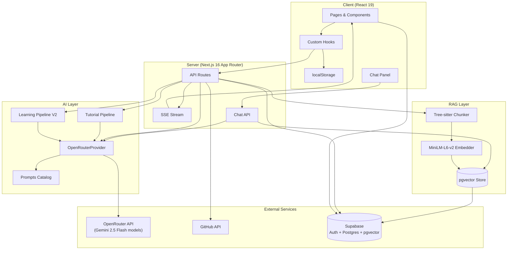
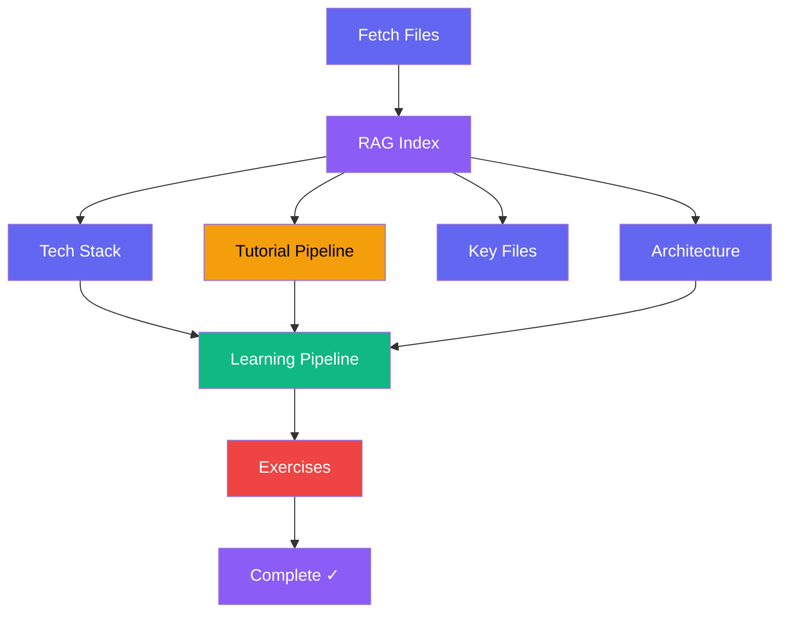

<p align="center">
  <br />
  <code>🐛 → 🪺 → 🦋</code>
  <br />
  <br />
</p>

<h1 align="center">CodeCocoon</h1>

<p align="center">
  <strong>Your AI-generated code is wrapped up. Let's unwrap it together.</strong>
</p>

<p align="center">
  You built it with AI. Now understand what's inside.<br />
  Connect your GitHub repo (or upload your code), get your codebase analyzed, and emerge as a real developer.
</p>

<p align="center">
  
  
  
  
  
  
  
</p>

---

## The Metaphor

**Two layers of transformation:**

- **You** are the caterpillar 🐛 — you vibe-coded a project, and now you're entering the cocoon to learn what it actually does. When you emerge, you're a butterfly 🦋 — a real developer who understands every line.
- **Your code** is the cocoon 🪺 — it's all wrapped up, generated by AI, layers you haven't explored. CodeCocoon unwraps it layer by layer until you understand the full picture.

## What It Does

| Step | Action |
|------|--------|
| 🔗 **Connect** | Paste any public GitHub URL, browse your repos, or upload local files/folders |
| 🔍 **Analyze** | AI breaks down your codebase: tech stack, architecture, key files, code quality |
| 📖 **Tutorial** | Get beginner-friendly chapters explaining your project's core concepts with diagrams |
| 📚 **Learn** | Personalized skill tree built from *your own code* — not generic tutorials |
| 💪 **Practice** | 7 exercise types using snippets from your actual project |
| 💬 **Chat** | Ask questions about your codebase and get AI answers grounded in your code |
| 📊 **Track** | Save projects, track progress, revisit anytime |

## How It Works

```
Paste repo URL ──→ Select files ──→ AI Pipeline (14 steps) ──→ Results
     🔗               📁              🧠                         🦋
                                       │
                    ┌──────────────────┼──────────────────┐
                    ▼                  ▼                  ▼
              📖 Tutorial       📚 Learning Path    💪 Exercises
            (chapters with      (skill tree with     (7 types from
             mermaid diagrams)   role presets)        your code)
                                                          │
                                                     💬 Chat
                                                   (ask anything
                                                    about your code)
```

1. **Paste a GitHub URL** (or upload local files, or browse your repos after signing in)
2. **Select files** to analyze and choose your **skill level** (🐛 Beginner / 🪺 Intermediate / 🦋 Advanced) and **role** (Frontend, Backend, Fullstack, DevOps, PM, QA)
3. **Watch the AI work** — real-time SSE streaming shows each analysis step as it completes (many run in parallel)
4. **Get your results** — tech stack breakdown, architecture overview, key files explained
5. **Read the tutorial** — beginner-friendly chapters with Mermaid diagrams explaining your project's abstractions
6. **Navigate the skill tree** — role-filtered learning path with prerequisite DAG and curated resources
7. **Do the exercises** — 7 exercise types, all built from your project's actual code and aligned with your learning path
8. **Ask questions** — chat panel lets you ask anything about your codebase, powered by RAG retrieval

---

## Architecture



---

## AI Pipeline

The main processing pipeline runs 14 steps via SSE streaming. Independent steps run in parallel for ~2x speedup. RAG indexing provides targeted code context to each step.



| # | Step | Model | Output |
|---|------|-------|--------|
| 1 | **Fetch Files** | — | Source code from GitHub API or uploads |
| 1.5 | **RAG Index** | MiniLM-L6-v2 | Semantic chunks embedded into pgvector |
| 2 | **Tech Stack** | `gemini-2.5-flash-lite` | Languages, frameworks, DBs, tools, styling |
| 3 | **Architecture** | `gemini-2.5-flash-lite` | Pattern, layers, entry points |
| 4 | **Key Files** | `gemini-2.5-flash-lite` | 8-12 most important files with roles |
| 5 | **Tutorial: Abstractions** | `gemini-2.5-flash-lite` | 5-10 core concepts (YAML) |
| 6 | **Tutorial: Relationships** | `gemini-2.5-flash-lite` | Concept graph + project summary (YAML) |
| 7 | **Tutorial: Chapter Order** | `gemini-2.5-flash-lite` | Pedagogical ordering (YAML) |
| 8 | **Tutorial: Chapters** | `gemini-2.5-flash` | N chapters with Mermaid diagrams (sequential) |
| 9 | **Learning: Concepts** | `gemini-2.5-flash-lite` | 10-20 role-filtered concepts |
| 10 | **Learning: Dependency Graph** | `gemini-2.5-flash-lite` | Prerequisite DAG + gap analysis |
| 11 | **Learning: Lessons** | `gemini-2.5-flash` | Explanations + codebase references |
| 12 | **Learning: Resources** | `gemini-2.5-flash-lite` | 3-5 curated resources per concept |
| 13 | **Exercises** | `gemini-2.5-flash` | 8 exercises across 7 types (concept-aligned) |

Steps 2-4 and 5a run in parallel (Wave 1). Exercises run after concepts, in parallel with lessons. All steps use RAG-retrieved code context instead of truncated file dumps.

<details>
<summary><strong>RAG Pipeline</strong></summary>

CodeCocoon uses Retrieval-Augmented Generation to provide targeted code context to each AI step:

1. **Semantic Chunking** — `web-tree-sitter` (WASM) parses code at function/class/module boundaries. Falls back to sliding-window chunking (300 lines, 50 overlap) for unsupported languages. Supports TypeScript, JavaScript, Python, Go, Java.
2. **Embedding** — `@huggingface/transformers` with `all-MiniLM-L6-v2` (384 dimensions) runs locally in Node.js. Singleton pipeline, lazy-loaded on first use.
3. **Vector Storage** — Supabase pgvector with HNSW index. Per-project collections via `project_id` column.
4. **Retrieval** — Each pipeline step queries pgvector with a natural-language description of what it needs (e.g., "Main entry points, routing definitions, middleware, and application structure"). Returns topK most relevant chunks.

This replaces the old approach of concatenating all files and truncating at 80k chars / 150 lines per file.

</details>

<details>
<summary><strong>Tutorial Pipeline (Steps 5-8)</strong></summary>

The tutorial pipeline generates beginner-friendly chapters that explain a project's core concepts:

1. **Identify Abstractions** — Extracts 5-10 core concepts with beginner-friendly descriptions and analogies
2. **Analyze Relationships** — Maps how concepts relate, generates a project summary
3. **Order Chapters** — Arranges concepts in pedagogical order (foundational first)
4. **Write Chapters** — Generates full Markdown chapters sequentially (each builds on previous), includes Mermaid `sequenceDiagram` visualizations and cross-chapter links

Each chapter includes: explanation, code examples from the repo, diagrams, and prev/next navigation.

</details>

<details>
<summary><strong>Learning Pipeline V2 (Steps 9-12)</strong></summary>

The learning pipeline builds a personalized skill tree:

1. **Concept Extraction** — Identifies 10-20 concepts filtered by the user's role, categorized as `language`, `framework`, `pattern`, `tooling`, `architecture`, or `library`
2. **Dependency Graph** — Builds a prerequisite DAG (max 3 prerequisites per node), assigns difficulty (1-5) and time estimates (5-60 min), plus gap analysis of what the user likely already knows
3. **Lesson Content** — Deep explanations (100-200 words) with "In Your Codebase" references and key takeaways
4. **Resource Curation** — 3-5 resources per concept: official docs, free tutorials, and paid courses

**Role Presets:**

| Role | Focus Areas |
|------|-------------|
| `fullstack_dev` | End-to-end: frontend, backend, database, deployment |
| `frontend_dev` | UI components, state management, styling, client-side logic |
| `backend_dev` | APIs, databases, auth, server-side logic |
| `devops_infra` | CI/CD, deployment, monitoring, infrastructure |
| `product_manager` | Architecture overview, data flow, feature mapping |
| `qa_testing` | Test patterns, error handling, edge cases |

The result is a visual skill tree with color-coded modules, prerequisite edges, and per-node completion tracking.

</details>

---

## Codebase Chat

A collapsible chat panel on the results page lets users ask questions about their analyzed codebase. Powered by RAG retrieval + LLM:

- **RAG-grounded answers** — queries pgvector for relevant code chunks before answering
- **Context-aware** — knows the project's tech stack, architecture, skill level, role, and learning path concepts
- **Streaming responses** — real-time SSE streaming with typing indicator
- **File references** — shows which files were used to answer each question
- **Skill-adapted** — adjusts explanation depth to match the user's skill level

---

## Exercise System

All exercises use real code snippets from the analyzed project — never generic examples. Exercises are aligned with the learning path concepts identified for each user.

| Type | Name | What You Do |
|------|------|-------------|
| 🐛 `error_injection` | **Bug Hunt** | Find 1-3 bugs injected into real code; explain fixes in natural language |
| ✏️ `code_recreation` | **Fill in the Blank** | Complete code with `___BLANK___` placeholders (2-3 for beginners, 4-6 for advanced) |
| 💬 `code_explanation` | **Explain** | Describe what a code snippet does in 3-5 sentences |
| 🔘 `mcq` | **Multiple Choice** | Answer a question about code behavior (4 options) |
| 🔮 `output_prediction` | **Predict Output** | Choose the correct output from 4 possibilities |
| 🧩 `parsons` | **Code Order** | Rearrange shuffled lines into correct order |
| 🚨 `error_message` | **Fix the Error** | Given code + error message, explain the cause and fix |

Exercises are AI-evaluated with anti-cheat detection (copy-paste detection) and type-specific grading rules.

---

## Tech Stack

| Layer | Technology | Purpose |
|-------|-----------|---------|
| **Framework** | Next.js 16 (App Router) | Server/client rendering, API routes, SSE streaming |
| **UI** | React 19 | Components, hooks, concurrent features |
| **Language** | TypeScript 5 | Type safety across the stack |
| **Styling** | Tailwind CSS v4 | Utility-first CSS with neo-brutalist design system |
| **AI** | OpenRouter (`openai` SDK) | `gemini-2.5-flash-lite` (analysis) + `gemini-2.5-flash` (generation) via OpenRouter |
| **RAG** | web-tree-sitter + @huggingface/transformers | Semantic chunking + local embeddings (all-MiniLM-L6-v2, 384d) |
| **Vector DB** | Supabase pgvector (HNSW) | Code chunk storage and similarity search |
| **Auth & DB** | Supabase | GitHub OAuth, Postgres with RLS, cookie-based SSR auth |
| **GitHub API** | Octokit | Repo tree/file fetching with auth fallback and concurrency control |
| **Code Editor** | CodeMirror 6 (`@uiw/react-codemirror`) | In-browser code editing with language support |
| **Code Display** | `react-syntax-highlighter` | Static code highlighting |
| **Diagrams** | Mermaid + Dagre | Architecture diagrams, skill tree layout |
| **Markdown** | `react-markdown` + `remark-gfm` | Rendering tutorial chapters and lesson content |
| **Icons** | `lucide-react` | Consistent icon set |
| **Fonts** | Space Grotesk / DM Sans / Geist Mono | Headings / body / code |

---

<details>
<summary><h2>API Routes</h2></summary>

| Route | Method | Description |
|-------|--------|-------------|
| `/api/process` | POST | Main SSE pipeline — 14 steps with parallel execution, returns streaming events |
| `/api/chat` | POST | Codebase chat — RAG-powered Q&A with SSE streaming responses |
| `/api/analyze` | POST | Standalone analysis (SSE stream) |
| `/api/github/repos` | GET | List authenticated user's repos |
| `/api/github/tree` | POST | Fetch repo file tree metadata |
| `/api/github/fetch` | POST | Fetch file contents for selected files |
| `/api/assess/questions` | POST | Generate 8-question skill quiz |
| `/api/assess/evaluate` | POST | Evaluate quiz answers |
| `/api/learn/generate` | POST | Generate learning path (standalone) |
| `/api/exercises/generate` | POST | Generate exercises (standalone) |
| `/api/exercises/evaluate` | POST | AI-grade exercise answer |
| `/api/projects/save` | POST | Save project to Supabase |
| `/api/projects/list` | POST | List user's saved projects |
| `/api/projects/check-duplicate` | POST | Check for duplicate project |
| `/api/projects/[id]` | GET/DELETE | Get or delete a project |
| `/api/upload` | POST | File/folder upload handler |

</details>

<details>
<summary><h2>Database Schema</h2></summary>

10 tables — 9 with Row Level Security (RLS), plus `code_chunks` for RAG.

| Table | Purpose |
|-------|---------|
| `profiles` | User profiles (auto-created on signup via trigger) |
| `projects` | Repo/upload records with status lifecycle: `pending → fetching → analyzing → complete → error` |
| `project_files` | Raw source file content per project |
| `analysis_results` | Tech stack, architecture, code quality, key files, summary, tutorial (all JSONB) |
| `assessments` | Quiz questions, answers, and scores |
| `learning_paths` | V1 (flat modules) or V2 (skill graph + role + gap analysis), versioned |
| `learning_progress` | Per-user, per-lesson completion tracking |
| `exercises` | All 7 exercise types with full metadata |
| `exercise_attempts` | Per-user answers, correctness, and AI feedback |
| `code_chunks` | RAG: semantic code chunks with `vector(384)` embeddings, HNSW-indexed |

Supports two project sources: `github` and `upload`.

</details>

---

## Getting Started

### Prerequisites

- Node.js 18+
- An OpenRouter API key ([get one here](https://openrouter.ai/keys))
- (Optional) A Supabase project for auth & persistence
- (Optional) A GitHub personal access token for higher rate limits

### Setup

```bash
# Clone the repo
git clone https://github.com/yourusername/codecocoon.git
cd codecocoon

# Install dependencies
npm install

# Set up environment variables
cp .env.local.example .env.local
# Edit .env.local with your keys

# Start the dev server
npm run dev
```

Open [http://localhost:3000](http://localhost:3000) and paste a GitHub repo URL to get started.

### Environment Variables

```env
NEXT_PUBLIC_SUPABASE_URL=         # Your Supabase project URL
NEXT_PUBLIC_SUPABASE_ANON_KEY=    # Your Supabase anon key
OPENROUTER_API_KEY=               # Required — OpenRouter API key
GITHUB_TOKEN=                     # Optional — increases rate limit (60 → 5000 req/hr)
```

### Commands

```bash
npm run dev      # Start dev server (localhost:3000)
npm run build    # Production build
npm run lint     # ESLint (core-web-vitals + typescript)
```

---

## Project Structure

```
codecocoon/
├── app/
│   ├── (auth)/                # Login & OAuth callback
│   ├── (main)/                # Feature pages
│   │   ├── connect/           # GitHub URL input or repo browser
│   │   ├── configure/         # File selection + skill level + role
│   │   ├── processing/        # Real-time SSE pipeline progress
│   │   ├── results/           # Analysis + tutorial + learning + exercises + chat
│   │   ├── analyze/           # Standalone analysis view
│   │   ├── learn/             # Learning path / skill tree
│   │   ├── exercises/         # Exercise practice
│   │   ├── assess/            # Skill assessment quiz
│   │   ├── upload/            # Local file/folder upload
│   │   ├── dashboard/         # Saved projects (auth required)
│   │   └── history/           # Project history
│   └── api/                   # 16 API routes (SSE + REST + Chat)
├── components/
│   ├── ui/                    # Design system (Button, Card, Input, etc.)
│   ├── chat/                  # Codebase chat panel (drawer + messages)
│   ├── layout/                # Navbar, Footer
│   ├── landing/               # Hero, Features, How-it-works
│   ├── results/               # SkillTree, Tutorial, LearningPath, Exercises
│   └── exercises/             # Exercise type components
├── lib/
│   ├── ai/                    # OpenRouterProvider, pipelines, prompts, schemas
│   ├── rag/                   # RAG pipeline: chunker, embedder, pgvector store
│   ├── github/                # URL parser, file fetcher, filter
│   └── supabase/              # Browser client, server client, middleware
├── hooks/                     # useAuth, useProcessing, useChat, useAnalysis, etc.
├── types/                     # TypeScript types (8 modules)
└── supabase/migrations/       # Database schema (10 tables)
```

---

<details>
<summary><h2>Limits & Constraints</h2></summary>

| Parameter | Value |
|-----------|-------|
| Max files per analysis | 100 |
| Max file size | 100 KB |
| Max total content | 500 KB |
| File size warning threshold | 50 KB |
| GitHub concurrent fetches | 5 |
| GitHub rate limit (no token) | 60 req/hr |
| GitHub rate limit (with token) | 5,000 req/hr |
| OpenRouter max concurrent requests | 5 |
| OpenRouter max retries | 5 |
| RAG embedding model | all-MiniLM-L6-v2 (384 dims) |
| RAG max embed chars per chunk | 1,500 |
| RAG topK per query | 6-12 (varies by step) |
| Tree-sitter supported languages | TypeScript, JavaScript, Python, Go, Java |
| Fallback chunking | 300 lines, 50 overlap |
| Chat message max length | 2,000 chars |
| Chat history max messages | 20 (most recent) |
| Supported file extensions | 30+ (TS, JS, Python, Go, Rust, Java, and more) |

</details>

## Contributing

Contributions are welcome! This project is in active development.

1. Fork the repo
2. Create a feature branch (`git checkout -b feature/amazing-feature`)
3. Commit your changes (`git commit -m 'Add amazing feature'`)
4. Push to the branch (`git push origin feature/amazing-feature`)
5. Open a Pull Request

## License

MIT

---
