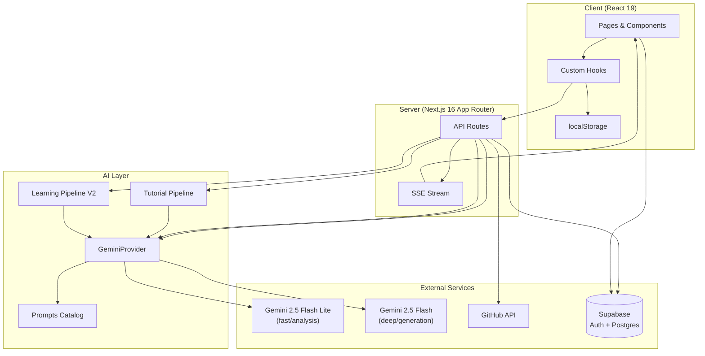

<p align="center">
  <br />
  <code>🐛 → 🪺 → 🦋</code>
  <br />
  <br />
</p>

<h1 align="center">CodeCocoon</h1>

<p align="center">
  <strong>Your AI-generated code is wrapped up. Let's unwrap it together.</strong>
</p>

<p align="center">
  You built it with AI. Now understand what's inside.<br />
  Connect your GitHub repo (or upload your code), get your codebase analyzed, and emerge as a real developer.
</p>

<p align="center">
  
  
  
  
  
  
  
</p>

---

## The Metaphor

**Two layers of transformation:**

- **You** are the caterpillar 🐛 — you vibe-coded a project, and now you're entering the cocoon to learn what it actually does. When you emerge, you're a butterfly 🦋 — a real developer who understands every line.
- **Your code** is the cocoon 🪺 — it's all wrapped up, generated by AI, layers you haven't explored. CodeCocoon unwraps it layer by layer until you understand the full picture.

## What It Does

| Step | Action |
|------|--------|
| 🔗 **Connect** | Paste any public GitHub URL, browse your repos, or upload local files/folders |
| 🔍 **Analyze** | AI breaks down your codebase: tech stack, architecture, key files, code quality |
| 📖 **Tutorial** | Get beginner-friendly chapters explaining your project's core concepts with diagrams |
| 📚 **Learn** | Personalized skill tree built from *your own code* — not generic tutorials |
| 💪 **Practice** | 7 exercise types using snippets from your actual project |
| 📊 **Track** | Save projects, track progress, revisit anytime |

## How It Works

```
Paste repo URL ──→ Select files ──→ AI Pipeline (13 steps) ──→ Results
     🔗               📁              🧠                         🦋
                                       │
                    ┌──────────────────┼──────────────────┐
                    ▼                  ▼                  ▼
              📖 Tutorial       📚 Learning Path    💪 Exercises
            (chapters with      (skill tree with     (7 types from
             mermaid diagrams)   role presets)        your code)
```

1. **Paste a GitHub URL** (or upload local files, or browse your repos after signing in)
2. **Select files** to analyze and choose your **skill level** (🐛 Beginner / 🪺 Intermediate / 🦋 Advanced) and **role** (Frontend, Backend, Fullstack, DevOps, PM, QA)
3. **Watch the AI work** — real-time SSE streaming shows each analysis step as it completes
4. **Get your results** — tech stack breakdown, architecture overview, key files explained
5. **Read the tutorial** — beginner-friendly chapters with Mermaid diagrams explaining your project's abstractions
6. **Navigate the skill tree** — role-filtered learning path with prerequisite DAG and curated resources
7. **Do the exercises** — 7 exercise types, all built from your project's actual code

---

## Architecture



---

## AI Pipeline

The main processing pipeline runs 13 steps via SSE streaming. Each step sends real-time progress to the client.


| # | Step | Model | Output |
|---|------|-------|--------|
| 1 | **Fetch Files** | — | Source code from GitHub API or uploads |
| 2 | **Tech Stack** | Flash Lite | Languages, frameworks, DBs, tools, styling |
| 3 | **Architecture** | Flash Lite | Pattern, layers, entry points |
| 4 | **Key Files** | Flash Lite | 8-12 most important files with roles |
| 5 | **Tutorial: Abstractions** | Flash Lite | 5-10 core concepts (YAML) |
| 6 | **Tutorial: Relationships** | Flash Lite | Concept graph + project summary (YAML) |
| 7 | **Tutorial: Chapter Order** | Flash Lite | Pedagogical ordering (YAML) |
| 8 | **Tutorial: Chapters** | Flash | N chapters with Mermaid diagrams (sequential) |
| 9 | **Learning: Concepts** | Flash Lite | 10-20 role-filtered concepts |
| 10 | **Learning: Dependency Graph** | Flash Lite | Prerequisite DAG + gap analysis |
| 11 | **Learning: Lessons** | Flash | Explanations + codebase references |
| 12 | **Learning: Resources** | Flash Lite | 3-5 curated resources per concept |
| 13 | **Exercises** | Flash | 8 exercises across 7 types |

<details>
<summary><strong>Tutorial Pipeline (Steps 5-8)</strong></summary>

The tutorial pipeline generates beginner-friendly chapters that explain a project's core concepts:

1. **Identify Abstractions** — Extracts 5-10 core concepts with beginner-friendly descriptions and analogies
2. **Analyze Relationships** — Maps how concepts relate, generates a project summary
3. **Order Chapters** — Arranges concepts in pedagogical order (foundational first)
4. **Write Chapters** — Generates full Markdown chapters sequentially (each builds on previous), includes Mermaid `sequenceDiagram` visualizations and cross-chapter links

Each chapter includes: explanation, code examples from the repo, diagrams, and prev/next navigation.

</details>

<details>
<summary><strong>Learning Pipeline V2 (Steps 9-12)</strong></summary>

The learning pipeline builds a personalized skill tree:

1. **Concept Extraction** — Identifies 10-20 concepts filtered by the user's role, categorized as `language`, `framework`, `pattern`, `tooling`, `architecture`, or `library`
2. **Dependency Graph** — Builds a prerequisite DAG (max 3 prerequisites per node), assigns difficulty (1-5) and time estimates (5-60 min), plus gap analysis of what the user likely already knows
3. **Lesson Content** — Deep explanations (100-200 words) with "In Your Codebase" references and key takeaways
4. **Resource Curation** — 3-5 resources per concept: official docs, free tutorials, and paid courses

**Role Presets:**

| Role | Focus Areas |
|------|-------------|
| `fullstack_dev` | End-to-end: frontend, backend, database, deployment |
| `frontend_dev` | UI components, state management, styling, client-side logic |
| `backend_dev` | APIs, databases, auth, server-side logic |
| `devops_infra` | CI/CD, deployment, monitoring, infrastructure |
| `product_manager` | Architecture overview, data flow, feature mapping |
| `qa_testing` | Test patterns, error handling, edge cases |

The result is a visual skill tree with color-coded modules, prerequisite edges, and per-node completion tracking.

</details>

---

## Exercise System

All exercises use real code snippets from the analyzed project — never generic examples.

| Type | Name | What You Do |
|------|------|-------------|
| 🐛 `error_injection` | **Bug Hunt** | Find 1-3 bugs injected into real code; explain fixes in natural language |
| ✏️ `code_recreation` | **Fill in the Blank** | Complete code with `___BLANK___` placeholders (2-3 for beginners, 4-6 for advanced) |
| 💬 `code_explanation` | **Explain** | Describe what a code snippet does in 3-5 sentences |
| 🔘 `mcq` | **Multiple Choice** | Answer a question about code behavior (4 options) |
| 🔮 `output_prediction` | **Predict Output** | Choose the correct output from 4 possibilities |
| 🧩 `parsons` | **Code Order** | Rearrange shuffled lines into correct order |
| 🚨 `error_message` | **Fix the Error** | Given code + error message, explain the cause and fix |

Exercises are AI-evaluated with anti-cheat detection (copy-paste detection) and type-specific grading rules.

---

## Tech Stack

| Layer | Technology | Purpose |
|-------|-----------|---------|
| **Framework** | Next.js 16 (App Router) | Server/client rendering, API routes, SSE streaming |
| **UI** | React 19 | Components, hooks, concurrent features |
| **Language** | TypeScript 5 | Type safety across the stack |
| **Styling** | Tailwind CSS v4 | Utility-first CSS with neo-brutalist design system |
| **AI** | Google Gemini (`@google/genai`) | `gemini-2.5-flash-lite` (analysis) + `gemini-2.5-flash` (generation) |
| **Auth & DB** | Supabase | GitHub OAuth, Postgres with RLS, cookie-based SSR auth |
| **GitHub API** | Octokit | Repo tree/file fetching with auth fallback and concurrency control |
| **Code Editor** | CodeMirror 6 (`@uiw/react-codemirror`) | In-browser code editing with language support |
| **Code Display** | `react-syntax-highlighter` | Static code highlighting |
| **Diagrams** | Mermaid + Dagre | Architecture diagrams, skill tree layout |
| **Markdown** | `react-markdown` + `remark-gfm` | Rendering tutorial chapters and lesson content |
| **Icons** | `lucide-react` | Consistent icon set |
| **Fonts** | Space Grotesk / DM Sans / Geist Mono | Headings / body / code |

---

<details>
<summary><h2>API Routes</h2></summary>

| Route | Method | Description |
|-------|--------|-------------|
| `/api/process` | POST | Main SSE pipeline — 13 steps, returns streaming events |
| `/api/analyze` | POST | Standalone analysis (SSE stream) |
| `/api/github/repos` | GET | List authenticated user's repos |
| `/api/github/tree` | POST | Fetch repo file tree metadata |
| `/api/github/fetch` | POST | Fetch file contents for selected files |
| `/api/assess/questions` | POST | Generate 8-question skill quiz |
| `/api/assess/evaluate` | POST | Evaluate quiz answers |
| `/api/learn/generate` | POST | Generate learning path (standalone) |
| `/api/exercises/generate` | POST | Generate exercises (standalone) |
| `/api/exercises/evaluate` | POST | AI-grade exercise answer |
| `/api/projects/save` | POST | Save project to Supabase |
| `/api/projects/list` | POST | List user's saved projects |
| `/api/projects/check-duplicate` | POST | Check for duplicate project |
| `/api/projects/[id]` | GET/DELETE | Get or delete a project |
| `/api/upload` | POST | File/folder upload handler |

</details>

<details>
<summary><h2>Database Schema</h2></summary>

9 tables with Row Level Security (RLS) — users can only access their own data.

| Table | Purpose |
|-------|---------|
| `profiles` | User profiles (auto-created on signup via trigger) |
| `projects` | Repo/upload records with status lifecycle: `pending → fetching → analyzing → complete → error` |
| `project_files` | Raw source file content per project |
| `analysis_results` | Tech stack, architecture, code quality, key files, summary, tutorial (all JSONB) |
| `assessments` | Quiz questions, answers, and scores |
| `learning_paths` | V1 (flat modules) or V2 (skill graph + role + gap analysis), versioned |
| `learning_progress` | Per-user, per-lesson completion tracking |
| `exercises` | All 7 exercise types with full metadata |
| `exercise_attempts` | Per-user answers, correctness, and AI feedback |

Supports two project sources: `github` and `upload`.

</details>

---

## Getting Started

### Prerequisites

- Node.js 18+
- A Google Gemini API key ([get one here](https://aistudio.google.com/apikey))
- (Optional) A Supabase project for auth & persistence
- (Optional) A GitHub personal access token for higher rate limits

### Setup

```bash
# Clone the repo
git clone https://github.com/yourusername/codecocoon.git
cd codecocoon

# Install dependencies
npm install

# Set up environment variables
cp .env.local.example .env.local
# Edit .env.local with your keys

# Start the dev server
npm run dev
```

Open [http://localhost:3000](http://localhost:3000) and paste a GitHub repo URL to get started.

### Environment Variables

```env
NEXT_PUBLIC_SUPABASE_URL=         # Your Supabase project URL
NEXT_PUBLIC_SUPABASE_ANON_KEY=    # Your Supabase anon key
GEMINI_API_KEY=                   # Required — Google Gemini API key
GITHUB_TOKEN=                     # Optional — increases rate limit (60 → 5000 req/hr)
```

### Commands

```bash
npm run dev      # Start dev server (localhost:3000)
npm run build    # Production build
npm run lint     # ESLint (core-web-vitals + typescript)
```

---

## Project Structure

```
codecocoon/
├── app/
│   ├── (auth)/                # Login & OAuth callback
│   ├── (main)/                # Feature pages
│   │   ├── connect/           # GitHub URL input or repo browser
│   │   ├── configure/         # File selection + skill level + role
│   │   ├── processing/        # Real-time SSE pipeline progress
│   │   ├── results/           # Analysis + tutorial + learning + exercises
│   │   ├── analyze/           # Standalone analysis view
│   │   ├── learn/             # Learning path / skill tree
│   │   ├── exercises/         # Exercise practice
│   │   ├── assess/            # Skill assessment quiz
│   │   ├── upload/            # Local file/folder upload
│   │   ├── dashboard/         # Saved projects (auth required)
│   │   └── history/           # Project history
│   └── api/                   # 15 API routes (SSE + REST)
├── components/
│   ├── ui/                    # Design system (Button, Card, Input, etc.)
│   ├── layout/                # Navbar, Footer
│   ├── landing/               # Hero, Features, How-it-works
│   ├── results/               # SkillTree, Tutorial, LearningPath, Exercises
│   └── exercises/             # Exercise type components
├── lib/
│   ├── ai/                    # GeminiProvider, pipelines, prompts, schemas
│   ├── github/                # URL parser, file fetcher, filter
│   └── supabase/              # Browser client, server client, middleware
├── hooks/                     # useAuth, useProcessing, useAnalysis, etc.
├── types/                     # TypeScript types (8 modules)
└── supabase/migrations/       # Database schema (9 tables with RLS)
```

---

<details>
<summary><h2>Limits & Constraints</h2></summary>

| Parameter | Value |
|-----------|-------|
| Max files per analysis | 100 |
| Max file size | 100 KB |
| Max total content | 500 KB |
| File size warning threshold | 50 KB |
| GitHub concurrent fetches | 5 |
| GitHub rate limit (no token) | 60 req/hr |
| GitHub rate limit (with token) | 5,000 req/hr |
| Gemini max retries | 5 |
| Gemini request gap | 7 seconds (~8.5 RPM) |
| Prompt max lines/file | 150 (truncated) |
| Prompt max total chars | 80,000 |
| Supported file extensions | 30+ (TS, JS, Python, Go, Rust, Java, and more) |

</details>

## Contributing

Contributions are welcome! This project is in active development.

1. Fork the repo
2. Create a feature branch (`git checkout -b feature/amazing-feature`)
3. Commit your changes (`git commit -m 'Add amazing feature'`)
4. Push to the branch (`git push origin feature/amazing-feature`)
5. Open a Pull Request

## License

MIT

---

